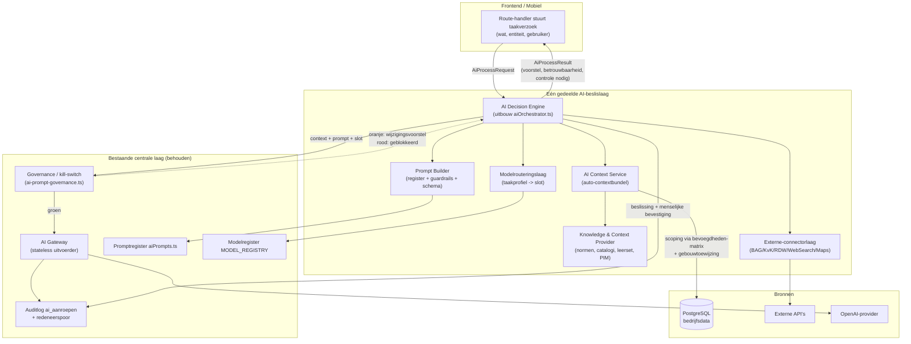
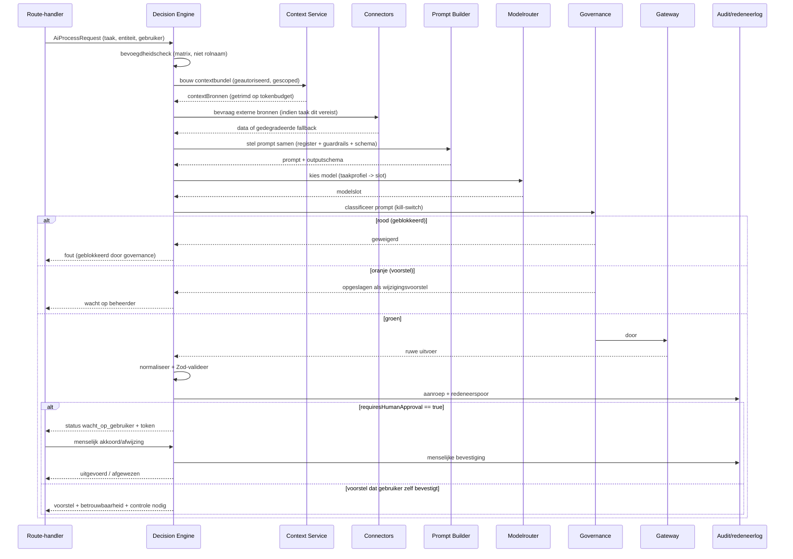
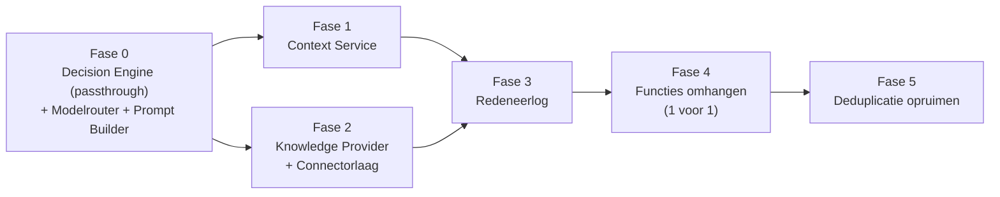

# Architectuur — Eén samenhangende AI-beslislaag voor FPS Connect

**Status:** Architectuur-/ontwerpdocument. GEEN implementatie. Bouwen pas ná expliciet akkoord op deze architectuur, als afzonderlijke, terugdraaibare taken.
**Datum:** 10 juli 2026
**Type oplevering:** documentatie (geen code, geen migraties, geen wijzigingen in `artifacts/` of `lib/`).
**Scope:** ontwerp van de doelarchitectuur waarin alle bestaande AI-capaciteiten samenkomen in één gedeelde AI-beslislaag, met als harde eis: **de AI ontvangt nooit alleen het huidige formulier — elk AI-verzoek krijgt automatisch de volledige relevante context.**

> Dit document bouwt voort op de bestaande centrale laag (gateway, promptregister, orchestrator-interfaces, governance, modelregister, auditlog) en op de eerdere ontwerpen [`ai-procesregisseur.md`](../ai-procesregisseur.md) en [`documenten-inbox.md`](../documenten-inbox.md). Het vindt niets parallel opnieuw uit; het maakt de bestaande fundering compleet en consistent.
>
> Kaders die te allen tijde gelden: [`docs/ontwikkelfilosofie.md`](../../ontwikkelfilosofie.md) (stabiliteit boven functionaliteit; beoordeelbaar increment) en [`docs/kwaliteitskader.md`](../../kwaliteitskader.md) (een taak is pas gereed als het volledige bedrijfsproces aantoonbaar correct werkt).

---

## Inhoudsopgave

1. [Managementsamenvatting](#1-managementsamenvatting)
2. [Inventarisatie van elke bestaande AI-capaciteit](#2-inventarisatie-van-elke-bestaande-ai-capaciteit)
3. [Gedupliceerde logica die wordt opgeruimd](#3-gedupliceerde-logica-die-wordt-opgeruimd)
4. [Doelarchitectuur — de zeven centrale componenten](#4-doelarchitectuur--de-zeven-centrale-componenten)
   - 4.1 [AI Context Service](#41-ai-context-service)
   - 4.2 [AI Decision Engine](#42-ai-decision-engine)
   - 4.3 [Prompt Builder](#43-prompt-builder)
   - 4.4 [Knowledge & Context Provider](#44-knowledge--context-provider)
   - 4.5 [Externe-databronnen connectorlaag](#45-externe-databronnen-connectorlaag)
   - 4.6 [AI-audit- en redeneerlog](#46-ai-audit--en-redeneerlog)
   - 4.7 [Modelrouteringslaag](#47-modelrouteringslaag)
5. [Componentdiagram en datastromen](#5-componentdiagram-en-datastromen)
6. [Migratie van elke bestaande AI-functie](#6-migratie-van-elke-bestaande-ai-functie)
7. [Migratieroadmap](#7-migratieroadmap)
8. [Implementatievolgorde (afhankelijkheden)](#8-implementatievolgorde-afhankelijkheden)
9. [Risico's en mitigaties](#9-risicos-en-mitigaties)
10. [Achterwaartse compatibiliteit](#10-achterwaartse-compatibiliteit)
11. [Performancestrategie](#11-performancestrategie)
12. [Beveiligingsstrategie](#12-beveiligingsstrategie)
13. [Verantwoording en ontwerpbesluiten](#13-verantwoording-en-ontwerpbesluiten)

---

## 1. Managementsamenvatting

FPS Connect kent vandaag ongeveer dertien losstaande AI-functies. Elk verzamelt zijn eigen context, bouwt zijn eigen prompt, kiest ad hoc een model en parseert zijn eigen JSON. Er is al een gedeeltelijke centrale laag — de **gateway** (`aiGateway.ts`), het **promptregister** (`aiPrompts.ts`), de **orchestrator-interfaces** (`aiOrchestrator.ts`), de **governance-/kill-switch** (`ai-prompt-governance.ts`), het **modelregister** (slots in `aiGateway.ts`) en het **auditlog** (`ai_aanroepen`) — maar de functies gebruiken die inconsistent. Vooral: de meeste sturen alleen het huidige formulier of het huidige object mee, zonder de bredere bedrijfscontext.

De doelarchitectuur voegt **zeven centrale componenten** toe bovenop deze fundering:

| # | Component | Kernrol |
|---|-----------|---------|
| 1 | **AI Context Service** | Stelt automatisch de volledige, geautoriseerde contextbundel samen voor elk verzoek. |
| 2 | **AI Decision Engine** | Centrale redeneer-/beslislaag; orkestreert context + prompt + model + connectors; borgt "AI stelt voor, mens beslist". |
| 3 | **Prompt Builder** | Bouwt prompts uit promptregister + contextbundel + gedeelde guardrails, met versiebeheer. |
| 4 | **Knowledge & Context Provider** | Levert domeinkennis en referentiedata (normen, catalogi, bibliotheek, few-shot-correcties, PIM). |
| 5 | **Externe-databronnen connectorlaag** | Uniforme interface voor BAG, KvK, RDW, Web Search en Google Maps. |
| 6 | **AI-audit- en redeneerlog** | Breidt `ai_aanroepen` uit met een redeneerspoor (context-snapshot, geraadpleegde bronnen, beslissing, menselijke bevestiging). |
| 7 | **Modelrouteringslaag** | Kiest per taak automatisch het juiste model op capaciteit/kosten/latency; modellen centraal verwisselbaar. |

Het leidende principe blijft ongewijzigd: **AI stelt voor, een mens beslist.** Voor elke statuswijzigende actie is menselijke goedkeuring verplicht. De governance-classificatie en de globale kill-switch blijven de eerste poort van elke aanroep. Alles blijft contract-first (OpenAPI → codegen), en alle context-scoping loopt via de bevoegdheden-matrix en gebouwtoewijzing — nooit via rolnaam.

De migratie is **strikt additief en incrementeel**: bestaande functies blijven werken terwijl ze één voor één achter de nieuwe lagen worden geschoven. Elke stap is een op zichzelf staande, beoordeelbare, terugdraaibare checkpoint.

---

## 2. Inventarisatie van elke bestaande AI-capaciteit

Onderstaande tabel bevat alle huidige AI-functies met per functie: doel, betrokken bestanden, gebruikt modelslot, welke context vandaag wordt meegestuurd, en hoe het resultaat wordt gebruikt (voorstel dat een mens bevestigt vs. passief/achtergrond).

| # | Functie | Doel | Betrokken bestanden | Modelslot | Context vandaag (bron) | Resultaatgebruik |
|---|---------|------|---------------------|-----------|------------------------|------------------|
| 1 | **Document Intelligence** | Documenten classificeren + kerngegevens extraheren (ETA, testrapport, DoP…) | `services/documentIntelligence.ts`, `services/document-ai.ts`, `routes/inbox.ts` | `fast` / `vision` (bij ontbrekende tekst) | Documenttekst, bestandsnaam; vision-fallback op PDF-render | Voorstel; mens bevestigt classificatie/koppeling |
| 2 | **Spotherkenning (few-shot)** | Brandwerende afwerking + product herkennen uit foto vóór/ná | `services/spot-ai.ts`, `routes/opname.ts` | `vision` | Foto vóór + ná, applicatiecatalogus, "leerset" van eerdere bevestigde spots in hetzelfde gebouw | Voorstel; monteur/kantoor bevestigt |
| 3 | **Gebouw-analyse (vision)** | Afmetingen/verdiepingen/type schatten uit satelliet + Street View | `services/gebouw-ai.ts`, `routes/gebouwen.ts` | `vision` | Satelliet- en Street View-beeld, schaal, adres | Voorstel (geel); mens bevestigt per veld |
| 4 | **Gebouw-tekstextractie / geocode** | Adres/geocode-metadata afleiden | `services/gebouw-ai.ts` | `fast` | Adresvelden, geocode-respons | Voorstel; vult formuliervelden |
| 5 | **Tekening/plattegrond-analyse** | Metadata uit bouwtekening halen | `services/gebouw-ai.ts` | `fast` / `vision` | Tekening-tekst of render | Voorstel; mens bevestigt |
| 6 | **E-mail-analyse (Inbox)** | Ruwe e-mail parsen + velden extraheren | `services/email-ai.ts`, `routes/inbox.ts` | `fast` | E-mailtekst/bijlagen (max ~4000 tekens) | Voorstel; routeert naar module |
| 7 | **Projectsamenvatting** | Samenvatting van gebouw/project genereren | `services/gebouw-ai.ts`, `routes/gebouwen.ts` | `default` | Gebouwvelden; bewerkbaar/bevestigbaar (geverifieerd-flag) | Voorstel; mens bevestigt |
| 8 | **Formulier smart-fill** (`/ai/invullen`) | Formuliervelden invullen met websearch + interne data | `routes/ai.ts` (`FORMULIER_VELDBESCHRIJVINGEN`) | `default` via Responses API (`web_search_preview`) | Huidige formulierwaarden + webzoekopdracht; DB-context beperkt | Voorstel; vult velden, mens bevestigt |
| 9 | **HRM opleidingen-voorstel** | Passende opleidingen/cursussen per functie voorstellen | `services/opleiding-ai.ts`, `routes/hrm.ts` | `reasoning` | Rijke functie-context (taken, competenties, vereisten, werkmaatschappij) | Voorstel; mens accepteert vóór opslaan |
| 10 | **Salarismutatie-controle** | Mutaties controleren op fouten/afwijkingen + SCAB-mail | `routes/salaris-mutaties.ts` | `default` | Volledige mutatielijst (JSON); `analyseerZonderAi()`-fallback | Voorstel (bevindingen); mens accordeert |
| 11 | **Offerte Studio tekstgeneratie** | Offerte-secties + begeleidende e-mail schrijven | `routes/offertes.ts` | `reasoning` | Offertetitel, klant/gebouw, top-8 begrotingsregels, uitgangspunten, andere secties | Concept; mens bewerkt/verstuurt |
| 12 | **CQO-kwaliteitsspecialisten** | 15 AI-persona's beoordelen platformkwaliteit (release-gate) | `services/cqo/engine.ts`, `cqo/fps-context.ts`, `cqo/specialisten.ts`, `routes/cqo.ts` | `default` (alle 15) | Statische `FPS_PLATFORM_CONTEXT` (geen live projectdata); batches van 3 | Dashboard voor hoofdbeheerder; gewogen score, harde blokkades |
| 13 | **Security-intake** | 8-staps risicoanalyse van bestanden/e-mails (OWASP-geïnspireerd) | `services/security-intake-engine.ts` | `fast` | Metadata + magic bytes + inhoud (max ~4000 tekens) | `risico_score` + status; geblokkeerd → handmatige beoordeling |

**Observaties die de architectuur stuurt:**

- Bijna elke functie kent alleen zijn eigen entiteit. Geen enkele weet de workflowstatus, eerdere inspecties/werkorders, gekoppelde documenten/contracten, of eerdere AI- of mensbesluiten.
- CQO gebruikt een **statische** platformbeschrijving in plaats van live data — een expliciet aandachtspunt voor de Context Service.
- `/ai/invullen` is de enige functie die vandaag al externe data (websearch) inzet; die logica hoort thuis in de connectorlaag.
- Overal geldt al "AI stelt voor, mens beslist"; dat is het te behouden fundament.

---

## 3. Gedupliceerde logica die wordt opgeruimd

Deze patronen zijn nu in vrijwel elke AI-service afzonderlijk geïmplementeerd. Ze worden verplaatst naar één centrale plek per verantwoordelijkheid.

| Gedupliceerd patroon | Waar het nu zit (voorbeelden) | Doel: waar het naartoe gaat |
|----------------------|-------------------------------|------------------------------|
| **Per-feature contextopbouw** | Elke `*-ai.ts` bouwt eigen context-string | **AI Context Service** (§4.1) |
| **Base64/vision-image-encoding** | `spot-ai.ts`, `gebouw-ai.ts` (`Buffer.toString("base64")`) | Gedeelde media-encoder in de **Context Service** / gateway-adapter |
| **"Antwoord alleen JSON"-instructie** | In elke prompt herhaald (`aiPrompts.ts`, `engine.ts`, `security-intake-engine.ts`) | Eén gedeelde guardrail in de **Prompt Builder** (§4.3) |
| **Sanitisatiehelpers** (`strOfNull`, `intOfNull`, `numOfNull`, `soortOf`) | `opleiding-ai.ts`, `spot-ai.ts`, `gebouw-ai.ts`, `engine.ts` | Eén gedeelde sanitisatie-/parselaag (§4.2, uitvoerverwerking) |
| **Betrouwbaarheidsscoring** (`laag`/`midden`/`hoog`, `risico_score`, `score`) | Overal net anders benoemd | Eén genormaliseerd betrouwbaarheidsveld in het **Decision-Engine-resultaat** |
| **Handmatig `JSON.parse` zonder Zod** | `engine.ts`, `spot-ai.ts`, `security-intake-engine.ts` | **Zod-gevalideerde outputschema's** per taak (contract-first, §4.3) |
| **Markdown-fence stripping** (` ```json … ``` `-regex) | `salaris-mutaties.ts`, meerdere services | Eén output-normalisatiestap in de Decision Engine |
| **Ad-hoc modelkeuze** (slot hard in de aanroep) | Elke service kiest zelf `default`/`fast`/`reasoning`/`vision` | **Modelrouteringslaag** (§4.7) kiest op taakprofiel |

Belangrijk: het **promptregister** (`aiPrompts.ts`) is al centraal en wordt niet gedupliceerd — dat blijft de bron van waarheid voor prompt-teksten. De Prompt Builder consumeert het; hij vervangt het niet.

---

## 4. Doelarchitectuur — de zeven centrale componenten

De doelarchitectuur plaatst één beslislaag tussen de route-handlers en de gateway. De route-handler levert alleen nog een **taakverzoek** (wat, voor welke entiteit, door wie). Alle context, prompts, modelkeuze, externe bronnen, uitvoering en logging gebeuren daarachter.

### Verantwoordelijkheidsgrenzen (ongewijzigd fundament)

- **Gateway** (`aiGateway.ts`) blijft de **stateless uitvoerder**: providersaanroep, timeout/retry, kostenberekening, logging naar `ai_aanroepen`, én de governance-/kill-switch als eerste poort. De gateway neemt nooit procesbeslissingen.
- **Decision Engine** (uitbouw van `aiOrchestrator.ts`) is de **beslisser**: wanneer AI mag draaien, wie akkoord moet geven, welke volgorde in meerstaps-flows, en wat er met het resultaat gebeurt.

Dit is precies de grens die `aiOrchestrator.ts` al beschrijft; de zeven componenten hieronder maken die grens compleet.

### 4.1 AI Context Service

**Doel:** vervul de harde eis. De Context Service stelt automatisch de volledige, geautoriseerde contextbundel samen voor elk AI-verzoek, zodat de AI nooit alleen het huidige formulier ziet.

**Verrijkt elk verzoek met (minimaal):**
huidig object, gerelateerde objecten, gebouw, project, klant, eerdere inspecties, eerdere werkorders, documenten, foto's, contracten, gebruikers, historie (eerdere AI- én mensbesluiten), bestaande formulierwaarden en externe referentiedata (via §4.5).

**Werking:**

1. **Ophalen (context resolvers).** Per entiteitstype (`gebouw`, `voorziening`, `offerte`, `medewerker`, `document`, `dossier`, `onderhoud`, `klant`, …) bestaat één resolver die de gerelateerde objecten ophaalt. Resolvers zijn samenstelbaar: de resolver voor `voorziening` roept die voor `gebouw` en `project` aan. De bundel is dus een graaf die vanuit het huidige object naar buiten wordt opgebouwd tot een configureerbare diepte.
2. **Afbakenen (autorisatie/scoping).** Elke resolver draait onder de effectieve context van de aanvragende gebruiker. Scoping gebeurt **via de bevoegdheden-matrix en gebouwtoewijzing, nooit via rolnaam** (conform de bestaande `effectieveContext`/`magBijGebouw`-patronen). Een gebruiker die een gebouw niet mag zien, krijgt dat gebouw ook niet in de AI-context. De Context Service is daarmee zelf een autorisatiegrens, geen bypass.
3. **Prioriteren en comprimeren (tokenbudget).** De bundel wordt getrimd op relevantie: recentheid (laatste inspecties/werkorders eerst), directe koppeling boven verre koppeling, en samenvatten van lange documenten. Er geldt een hard tokenbudget per modelslot; boven het budget wordt samengevat of geciteerd in plaats van volledig meegestuurd. Elke weggelaten of samengevatte bron wordt in het redeneerlog vastgelegd (§4.6).
4. **Cachen.** Contextfragmenten worden gecachet met een cachesleutel `entiteitstype + id + versie/bijgewerktOp + gebruikersscope-hash`. Invalidatéit bij mutatie van de entiteit. Zo betaalt herhaald bevragen van hetzelfde gebouw niet telkens de volledige opbouw.

**Relatie tot bestaande code:** de bundel wordt als `contextBronnen: AiContextBron[]` (het bestaande, uitbreidbare type in `aiGateway.ts`) aan de gateway meegegeven en opgeslagen in `context_json`. De flat businesscontext-velden (`gebouw_id`, `offerte_id`, `medewerker_id`, …) die `LogContext` al kent, worden automatisch gevuld door de Context Service.

**Aandachtspunt CQO:** de Context Service maakt het mogelijk om de statische `FPS_PLATFORM_CONTEXT` te vervangen door (of aan te vullen met) live platformmetadata. Dit is een aparte, latere migratiestap (§6) — niet vereist voor de basisarchitectuur.

### 4.2 AI Decision Engine

**Doel:** één redeneer-/beslislaag waar elk AI-verzoek doorheen loopt. Dit is de uitbouw van de bestaande `aiOrchestrator.ts`-interfaces (`AiProcessRequest`, `AiProcessResult`, `AiProcessStatus`) naar een werkende coördinator.

**Verantwoordelijkheden:**

1. **Taakdefinitie.** Een AI-taak is een declaratief profiel: `{ taaknaam, entiteitstype, vereiste bevoegdheid, contextdiepte, promptnaam, gewenst modelprofiel, benodigde connectors, outputschema, requiresHumanApproval }`. Taken staan in één taakregister (contract-first).
2. **Orkestratie.** Per taak: (a) governance-/kill-switch (blijft eerste poort, via de gateway), (b) bevoegdheidscheck via de matrix, (c) Context Service bevragen, (d) benodigde connectors aanroepen, (e) Prompt Builder de prompt laten samenstellen, (f) Modelrouter het model laten kiezen, (g) gateway aanroepen, (h) uitvoer normaliseren en Zod-valideren.
3. **Human-in-the-loop (hard).** Voor statuswijzigende acties is `requiresHumanApproval === true` verplicht. De engine pauzeert dan op status `wacht_op_gebruiker` en geeft een `humanApprovalToken` terug; verwerking gebeurt pas na expliciete goedkeuring (hergebruik van bestaande goedkeuringsmechanismen zoals de DMS-goedkeuringsflow). AI keurt nooit zelfstandig juridisch of definitief goed.
4. **Uitkomst.** De engine geeft een genormaliseerd resultaat terug: `{ status, voorstel, betrouwbaarheid (genormaliseerd), controleNodig (bij lage zekerheid), aanroepId }`. "Controle nodig" is een expliciet signaal bij lage betrouwbaarheid, zodat de UI extra menselijke aandacht kan vragen.

**Passthrough blijft behouden:** waar `requiresHumanApproval === false` en er geen actieve meerstaps-flow is, gedraagt de engine zich als directe doorgifte naar de gateway — precies het passthrough-contract dat `aiOrchestrator.ts` al vastlegt. Zo merken bestaande modules geen verschil tijdens de migratie.

### 4.3 Prompt Builder

**Doel:** één component dat prompts samenstelt uit het bestaande **promptregister** + de contextbundel + gedeelde **guardrails**, met versiebeheer — zonder per-feature-duplicatie.

**Werking:**

- **Bron:** promptteksten blijven in `aiPrompts.ts` (naam + semver), inclusief de reeds aanwezige `AiPrompt`-structuur. De Prompt Builder voegt geen tweede promptbron toe.
- **Samenstellen:** `systemprompt (uit register) + gedeelde guardrails + contextbundel (uit Context Service) + outputschema-instructie`. De gedeelde guardrails bevatten precies de nu overal herhaalde regels: "antwoord alleen als geldige JSON", "verzin niets; laat onbekende velden op null", betrouwbaarheidsveld, en de "AI bepaalt nooit brandwerendheid/juridische classificatie"-regel waar van toepassing.
- **Outputschema (contract-first):** per taak hoort een Zod-schema. De Prompt Builder neemt het schema mee als instructie én de Decision Engine valideert de uitvoer ertegen. Dit vervangt het overal handmatige `JSON.parse` + markdown-fence-stripping.
- **Versiebeheer:** de gebruikte prompt-naam + versie worden (zoals nu al mogelijk via `LogContext.promptNaam`/`promptVersie`) gelogd, zodat elke uitvoer herleidbaar is naar de exacte prompt-versie.

### 4.4 Knowledge & Context Provider

**Doel:** één laag voor domeinkennis en referentiedata die de AI nodig heeft, los van de operationele objectcontext.

**Levert:**
- normen/testnormen en de afgeleide brandwerendheid-logica (de testnorm is de bron van waarheid — de AI bepaalt die nooit zelf);
- de applicatie-/toepassingencatalogus (de ~62 SnagStream-types) en de bibliotheek (applicaties, toepassingen, documenten, ETA's);
- **few-shot expertcorrecties** — o.a. de "leerset" van eerder bevestigde spots per gebouw (het bestaande `spot_ai_voorstellen`/leerset-mechanisme), zodat de AI consistent met eerdere menselijke besluiten voorstelt;
- de bestaande **PIM-context** — expliciet **alleen AI-context, geen operationele data** (conform de PIM-architectuur).

**Relatie tot de Context Service:** de Context Service levert *object-specifieke* context (dit gebouw, deze offerte). De Knowledge & Context Provider levert *domeinbrede* kennis (normen, catalogi, leerset). De Decision Engine combineert beide in één bundel. De Provider is daarmee een gespecialiseerde bron die de Context Service aanroept, geen concurrent ervan.

### 4.5 Externe-databronnen connectorlaag

**Doel:** één uniforme connector-interface voor externe bronnen, met de huidige bronnen als vertrekpunt: **BAG, KvK, RDW, Web Search en Google Maps** (geocode/satelliet/Street View).

**Uniform contract (per connector):** `bevraag(invoer) → { ok, data | fout, bron, opgehaaldOp }`. Elke connector implementeert dezelfde interface, zodat de Decision Engine ze inwisselbaar aanroept.

**Gedeelde eigenschappen:**
- **Caching:** resultaten cachen op sleutel (bijv. adres → BAG, kenteken → RDW) met een bron-specifieke TTL; externe bronnen wijzigen zelden binnen een sessie.
- **Rate-limiting:** per connector een limiet, zodat een piek in AI-verzoeken de externe API niet overbelast.
- **Foutafhandeling/fallback:** een falende connector blokkeert het AI-verzoek niet; hij levert een lege/gedegradeerde bron en dat feit wordt in het redeneerlog vastgelegd. (Dit is precies het huidige gedrag van `/ai/invullen`, dat bij een falende websearch terugvalt op een gewone chat-aanroep — nu gegeneraliseerd.)
- **Secrets serverside:** alle sleutels (o.a. `GOOGLE_MAPS_API_KEY`) blijven serverside; de connectorlaag geeft nooit sleutels of ruwe upstream-fouten door naar client of log (bestaande redactie-afspraak).

De reeds werkende Google Maps-embed en de websearch in `/ai/invullen` zijn de eerste twee connectors die in dit contract worden ingepast; BAG/KvK/RDW worden **alleen ontworpen**, niet aangesloten (out of scope).

### 4.6 AI-audit- en redeneerlog

**Doel:** bouw voort op het bestaande `ai_aanroepen`-auditlog en breid uit met een **redeneerspoor**.

**Bestaand (`ai_aanroepen`):** module, functie, gebruiker, entiteit, modelslot/-naam, prompt-naam/-versie/-hash, tokens, kosten, duur, status, foutmelding, `context_json`, uitvoertekst. Dit blijft ongewijzigd de ruwe aanroeplog.

**Toe te voegen redeneerspoor (conceptueel — te ontwerpen als uitbreiding, niet nu te migreren):** per AI-taak vastleggen:
- welke **context-snapshot** is gebruikt (welke bronnen, welke zijn samengevat/weggelaten en waarom — tokenbudget);
- welke **connectors** zijn geraadpleegd en met welk resultaat/fallback;
- welk **model** door de router is gekozen en waarom (taakprofiel);
- welk **voorstel/beslissing** en de genormaliseerde **betrouwbaarheid**;
- de **menselijke bevestiging** (wie, wanneer, akkoord/afwijzing) — de sluitsteen van "AI stelt voor, mens beslist".

Dit sluit aan op wat `aiOrchestrator.ts` al beschrijft: de gateway logt de ruwe aanroep in `ai_aanroepen`; de engine logt de beslissing in de audit trail (`logAudit`). Het redeneerspoor kan grotendeels in de bestaande `context_json` en de generieke audit trail landen, plus een lichte uitbreiding voor de goedkeuringskoppeling.

**Bewaartermijn en privacy (AVG):**
- **Dataminimalisatie:** de context-snapshot bewaart bij voorkeur verwijzingen (entiteit-id's) in plaats van gekopieerde persoonsgegevens; alleen wat nodig is voor herleidbaarheid.
- **Bewaartermijn:** het redeneerspoor krijgt een expliciete retentieperiode; na afloop worden snapshots opgeschoond terwijl de geaggregeerde aanroepmetriek (kosten/tokens) bewaard mag blijven.
- **Toegang:** inzage in het redeneerlog is voorbehouden aan de hoofdbeheerder (zoals de bestaande `ai-log`-routes), en valt onder dezelfde secret-redactie als de gateway.

### 4.7 Modelrouteringslaag

**Doel:** bouw voort op het bestaande modelregister (slots `default`/`fast`/`reasoning`/`vision`/`embedding`) en kies per taak automatisch het juiste model.

**Werking:**
- Elke AI-taak declareert een **taakprofiel**: vereist vision? vereist redenering? kosten- of latency-gevoelig?
- De router mapt het profiel op een **slot** (niet op een hard modelnaam), zodat het bestaande `MODEL_REGISTRY` de enige plek blijft waar modelnamen staan. Vision-taken → `vision`; zware redeneertaken (opleidingen, offerte-secties) → `reasoning`; kostengevoelige bulk (security-scan, e-mail) → `fast`; standaard → `default`; embeddings → `embedding`.
- **Centraal verwisselbaar:** een model upgraden of vervangen gebeurt op één plek (`MODEL_REGISTRY`), zonder enige service aan te raken. De prijstabel (`PRIJS_PER_MODEL`) en kostenberekening blijven daaraan gekoppeld.
- De router legt de gekozen slot/reden vast in het redeneerlog (§4.6).

Dit formaliseert wat nu impliciet en ad hoc gebeurt (elke service kiest zelf een slot) tot een expliciete, testbare beslissing — zonder het registermodel te veranderen.

---

## 5. Componentdiagram en datastromen

### 5.1 Doelarchitectuur — componenten



### 5.2 Datastroom — één AI-verzoek (met verplichte human-in-the-loop)



---

## 6. Migratie van elke bestaande AI-functie

Voor elke functie uit §2: hoe die overgaat naar de nieuwe lagen, wat verandert en wat behouden blijft. Het patroon is overal gelijk: **behouden** = het promptregister-gebruik, de gateway-uitvoering, governance, en "AI stelt voor, mens beslist"; **verandert** = contextopbouw naar de Context Service, modelkeuze naar de router, parsing naar Zod, en logging naar het redeneerlog.

| Functie | Belangrijkste verandering | Wat behouden blijft |
|---------|---------------------------|---------------------|
| **1. Document Intelligence** | Context uit Context Service (gekoppeld gebouw/project/klant/dossier i.p.v. alleen documenttekst); Zod-schema i.p.v. handmatige parse | Staged classificatiemotor, vision-fallback, promptregister |
| **2. Spotherkenning** | Leerset komt via Knowledge Provider; context krijgt gebouw/scheidingen/eerdere spots; router kiest `vision` | Foto vóór/ná-flow, "AI bepaalt nooit brandwerendheid", mens bevestigt |
| **3. Gebouw-analyse (vision)** | Maps-connector via connectorlaag; context krijgt bestaande gebouwvelden + eerdere analyses | Geel-voorstel-per-veld, geverifieerd-flag |
| **4. Gebouw-tekstextractie/geocode** | Geocode via Maps-connector; sanitisatie centraal | Formuliervelden-vulling als voorstel |
| **5. Tekening/plattegrond-analyse** | Context Service + router (`vision`/`fast`) | Voorstel; mens bevestigt |
| **6. E-mail-analyse (Inbox)** | Context krijgt bekende relaties (klant/gebouw/offerte) i.p.v. alleen e-mailtekst; security-intake blijft voorgeschakeld | Parsing-route, module-routering |
| **7. Projectsamenvatting** | Context Service levert volledige gebouw/project-graaf i.p.v. losse velden | Bewerkbaar/bevestigbaar, geverifieerd-flag |
| **8. Formulier smart-fill (`/ai/invullen`)** | Websearch wordt een connector; interne DB-context via Context Service; Zod-schema per formuliertype | Voorstel dat velden vult, mens bevestigt |
| **9. HRM opleidingen-voorstel** | Functie-context via Context Service + Knowledge Provider; router kiest `reasoning` | "Mens accepteert vóór opslaan" (hard), rijke functievelden |
| **10. Salarismutatie-controle** | Genormaliseerde betrouwbaarheid + Zod; markdown-stripping centraal | `analyseerZonderAi()`-fallback, mens accordeert, SCAB-mail als concept |
| **11. Offerte Studio** | Context Service levert begrotingsregels/uitgangspunten/andere secties automatisch | Concept per sectie, mens bewerkt/verstuurt |
| **12. CQO-specialisten** | Statische `FPS_PLATFORM_CONTEXT` aanvullen/vervangen met live context uit de Context Service; router expliciet | 15 persona's, gewogen score, release-blokkades, dashboard-review |
| **13. Security-intake** | Blijft `fast`; wordt een expliciete taak in de engine (voorgeschakeld aan Inbox-taken) | 8-staps pipeline, `risico_score`, handmatige beoordeling bij blokkade |

Elke migratie is een **afzonderlijke taak** met eigen Definition of Done en business-scenario-validatie.

---

## 7. Migratieroadmap

De migratie is strikt additief: eerst de lagen bouwen (zonder bestaande functies aan te raken), dan functies één voor één omhangen, telkens als beoordeelbaar, terugdraaibaar increment.

**Fase 0 — Fundament formaliseren (geen gedragswijziging).**
Decision Engine als werkende passthrough bovenop de gateway (implementatie van de bestaande `aiOrchestrator.ts`-interfaces). Modelrouteringslaag als expliciete mapping (taakprofiel → bestaand slot). Prompt Builder met gedeelde guardrails + Zod-outputschema's, aanvankelijk alleen aangeboden, nog niet afgedwongen. Resultaat: alles werkt exact als nu, maar de haakjes bestaan.

**Fase 1 — Context Service (kern van de harde eis).**
Context resolvers per entiteitstype met matrix-/gebouwtoewijzing-scoping, tokenbudget-trimming en caching. Nog niet aangesloten op functies — eerst los valideerbaar (levert de bundel correct en geautoriseerd?).

**Fase 2 — Knowledge & Context Provider + connectorlaag.**
Normen/catalogi/leerset/PIM als Provider. Google Maps en websearch als eerste twee connectors in het uniforme contract. BAG/KvK/RDW alleen als ontwerp/stub.

**Fase 3 — Redeneerlog.**
Uitbreiding van de audit met context-snapshot, geraadpleegde bronnen, modelkeuze en menselijke bevestiging; retentie/AVG-beleid actief.

**Fase 4 — Functies omhangen (één voor één).**
Volgorde op risico/afhankelijkheid: eerst read-mostly voorstelfuncties (opleidingen, projectsamenvatting, offerte-secties), dan vision (spot, gebouw), dan document/e-mail/inbox, dan security-intake, tot slot CQO (live context). Elke functie is een eigen checkpoint.

**Fase 5 — Deduplicatie opruimen.**
Pas nadat een functie is omgehangen, worden de nu gedupliceerde helpers (sanitizers, fence-stripping, per-feature context) uit die functie verwijderd. Nooit vóór de omhang.

---

## 8. Implementatievolgorde (afhankelijkheden)



Expliciete afhankelijkheden:
- **Fase 0 heeft geen afhankelijkheid** en verandert geen gedrag (veiligste start).
- **Context Service (1)** vereist alleen de bestaande scoping-primitieven (`effectieveContext`, `magBijGebouw`), niet de andere nieuwe lagen.
- **Knowledge Provider + connectors (2)** kunnen parallel aan Fase 1.
- **Redeneerlog (3)** vereist zowel Context Service als connectors (het legt hún output vast).
- **Functies omhangen (4)** vereist dat alle lagen er zijn.
- **Deduplicatie (5)** mag pas ná omhang per functie — nooit eerder.

---

## 9. Risico's en mitigaties

| Risico | Impact | Mitigatie |
|--------|--------|-----------|
| **Contextbundel wordt te groot / te duur** | Hoge tokenkosten, trage antwoorden | Hard tokenbudget per slot, prioritering + samenvatting in Context Service, caching; kosten blijven zichtbaar via `ai_aanroepen` + drempelcheck |
| **Autorisatielek via context** | AI ziet data buiten de scope van de gebruiker | Scoping in elke resolver via matrix + gebouwtoewijzing (nooit rolnaam); Context Service is zelf een autorisatiegrens; testen per rol/scope |
| **Regressie bij omhangen van een functie** | Bestaande AI-functie breekt | Strikt incrementeel per functie; passthrough garandeert identiek gedrag; elke stap eigen checkpoint + business-scenario-validatie; terugdraaibaar |
| **Externe connector valt uit** | AI-verzoek blokkeert | Gedegradeerde fallback (leeg + gelogd), nooit hard falen; rate-limiting tegen cascade |
| **Governance/kill-switch omzeild door nieuwe laag** | Ongecontroleerde prompts | Governance blijft eerste poort ín de gateway; de engine kan die niet omzeilen — alle verkeer loopt via `aiGateway.chat/responses` |
| **Prompt-injectie via context of externe bron** | Model volgt kwaadaardige instructie | Externe/onbetrouwbare tekst wordt als data gemarkeerd (niet als instructie); guardrails in Prompt Builder; governance-scan |
| **Scope creep richting autonome AI** | Schending kernprincipe | `requiresHumanApproval` verplicht voor statuswijziging; AI keurt nooit juridisch/definitief goed; vastgelegd in taakregister |
| **CQO-live-context introduceert instabiliteit** | Release-gate wordt onbetrouwbaar | CQO als laatste omhangen; live context aanvankelijk aanvullend op de statische context, niet vervangend |

---

## 10. Achterwaartse compatibiliteit

- **Niets breekt tijdens de migratie.** De gateway, het promptregister, het modelregister en `ai_aanroepen` blijven ongewijzigd bruikbaar. Bestaande services kunnen tijdens de hele migratie direct de gateway blijven aanroepen.
- **Passthrough-contract.** De Decision Engine gedraagt zich standaard als directe doorgifte (het contract dat `aiOrchestrator.ts` al vastlegt). Een functie die nog niet is omgehangen, merkt niets van de nieuwe laag.
- **Additieve datamodel-wijzigingen.** Het redeneerlog is een uitbreiding op `context_json` + de generieke audit trail; bestaande kolommen wijzigen niet. Nieuwe kolommen/tabellen zijn additief (conform de projectafspraak dat DB-wijzigingen additief zijn).
- **Contract-first blijft leidend.** Elke nieuwe endpoint of gewijzigd contract gaat eerst door de OpenAPI-spec + codegen; geen handmatige types.
- **`AiContextBron` is al voorbereid.** Het open-union contextbrontype en de `contextBronnen`-lijst bestaan al in de gateway; de Context Service vult wat vandaag leeg blijft — geen breaking change.

---

## 11. Performancestrategie

- **Contextopbouw:** resolvers halen alleen op wat de taak nodig heeft (contextdiepte per taakprofiel); geen "haal alles op". Parallelle resolvers waar de bronnen onafhankelijk zijn.
- **Caching:** contextfragmenten en connector-resultaten worden gecachet met invalidatie bij mutatie; herhaalde bevraging van hetzelfde gebouw/klant is goedkoop.
- **Tokenbudget:** hard budget per modelslot; boven budget wordt samengevat/geciteerd i.p.v. volledig meegestuurd. Het redeneerlog registreert wat is weggelaten.
- **Parallelisme:** meerstaps- en batchtaken (zoals de 15 CQO-specialisten) blijven gethrottled in batches om providerquota te respecteren; de engine centraliseert die throttling in plaats van per service.
- **Latency:** modelrouting kiest `fast` voor kostengevoelige/bulk-taken en `reasoning`/`vision` alleen waar nodig; timeout/retry blijven in de gateway (bestaand). Fire-and-forget-logging houdt de kritieke pad-latency laag.
- **Kostenbewaking:** `ai_aanroepen` + de bestaande maand-kostendrempel (`aiKostendrempelEur`) blijven de plek waar totale kosten zichtbaar en begrensd zijn.

---

## 12. Beveiligingsstrategie

- **Autorisatie/scoping van context:** elke context-resolver draait onder de effectieve context van de gebruiker en scope't via de **bevoegdheden-matrix en gebouwtoewijzing** — nooit via rolnaam. De Context Service kan geen data leveren die de gebruiker zelf niet mag zien. Dit geldt ook voor impersonatie ("bekijken als"): het leesfilter gebruikt de geïmpersoneerde context, terwijl permissie-gating op de echte rol blijft.
- **Secrets:** alle API-sleutels blijven serverside in de connectorlaag; nooit naar client of log. De bestaande foutmelding-sanitisatie in de gateway (redactie van sleutelpatronen) blijft actief, en upstream-fouten van externe bronnen worden geredigeerd vóór opslag/log.
- **Promptinjectie/governance:** de governance-classificatie en globale kill-switch blijven de **eerste poort** van elke aanroep (rood = geblokkeerd, oranje = wijzigingsvoorstel, groen = door). Externe en door gebruikers aangeleverde tekst wordt in de contextbundel als **data** behandeld, expliciet gescheiden van instructies; guardrails in de Prompt Builder herhalen de "verzin niets / bepaal nooit juridische classificatie"-regels.
- **Dataminimalisatie/AVG:** de context-snapshot bewaart bij voorkeur verwijzingen (id's) i.p.v. gekopieerde persoonsgegevens; het redeneerlog krijgt een expliciete bewaartermijn met opschoning; inzage is voorbehouden aan de hoofdbeheerder. Alleen wat nodig is voor herleidbaarheid en kostentoewijzing wordt bewaard.
- **Human-in-the-loop als beveiligingslaag:** omdat AI nooit zelfstandig statuswijzigende of juridische besluiten neemt, is er altijd een menselijke poort tussen AI-voorstel en effect — vastgelegd in het redeneerlog.

---

## 13. Verantwoording en ontwerpbesluiten

- **Waarom voortbouwen i.p.v. herbouwen.** De centrale laag (gateway, register, orchestrator-interfaces, governance, modelregister, auditlog) is al aanwezig en bewust ontworpen met de juiste verantwoordelijkheidsgrens (stateless gateway vs. besluitvormende orchestrator) en met een uitbreidbaar contextbrontype. De zeven componenten maken die fundering compleet zonder iets parallels te introduceren.
- **Waarom de Context Service de kern is.** De harde eis — de AI ziet nooit alleen het formulier — is een architectuureigenschap, geen per-functie-afspraak. Door contextopbouw centraal en verplicht te maken, kan geen enkele functie die eis per ongeluk omzeilen.
- **Waarom scoping via de matrix, niet via rolnaam.** De rest van het platform doet dit al zo (effectieve context, gebouwtoewijzing); de AI-laag mag geen tweede, afwijkend autorisatiemodel introduceren.
- **Waarom strikt incrementeel.** Conform de ontwikkelfilosofie (stabiliteit boven functionaliteit) en het kwaliteitskader (aantoonbaar werkend businessproces per increment): elke functie wordt afzonderlijk omgehangen en gevalideerd, en de deduplicatie volgt pas ná de omhang, zodat elk increment terugdraaibaar blijft.
- **Wat expliciet buiten scope is.** Geen implementatie, geen migraties, geen aansluiting van BAG/KvK/RDW/Web Search, geen wijzigingen aan mobiel/frontend. Dit document is uitsluitend het ontwerp; bouwen gebeurt in afzonderlijke taken ná akkoord.

---

*Einde architectuurdocument. Dit ontwerp respecteert de bestaande centrale laag, het principe "AI stelt voor, mens beslist", de governance/kill-switch, contract-first (OpenAPI → codegen) en de matrix-/gebouwtoewijzing-gedreven scoping.*
